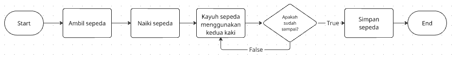

# Technical Test PT Aneka Search Indonesia

| Nama | Email |
|--- | --- |
| Pujo Prasetyo Aji | pujo.prasetyoaji@gmail.com |

---
## I. Pseudocode untuk mengayuh sepeda
1. Ambil sepeda
2. Naiki sepeda
3. Kayuh menggunakan kedua kaki secara bergantian
4. Jika sudah sampai di tujuan berhenti, jika tidak terus kayuh
5. Simpan sepeda

gambaran flowchart untuk pseudocode pertama

---
## II. Pseudocode untuk menghitung luas selimut tabung
1. Masukkan nilai phi (π), jari-jari (r), dan tinggi rusuk (t)
2. Hitung luas selimut dengan menggunakan rumus 2*phi*r*t
3. Tampilkan nilai hasil perkalian

---

## III. Pseudocode untuk menghitung bilangan fibonacci
1. Tampilkan pesan untuk memasukkan nilai n atau jumlah bilangan fibonacci yang diinginkan
2. User memasukkan nilai n
3. Sistem menampilkan pesan "Deret Fibonacci hingga 'n' adalah:"
4. Sistem melakukan perulangan untuk memanggil fungsi fibonacci sebanyak n-kali
5. Sistem menghitung bilangan fibonacci dengan menambahkan nilai bilangan dengan nilai bilangan sebelumnya
6. Menampilkan seluruh bilangan fibonacci hingga n-kali